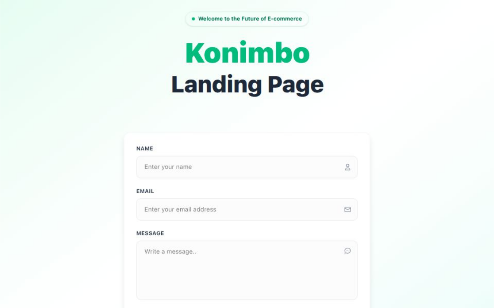

# 🧪 Landing Page with Form Integration (Next.js + Airtable)

A simple, responsive landing page built with Next.js. Includes a registration form that submits user data (Full Name, Email, Message) to an Airtable table using a secure API route.

---

## 🚀 Features

- Built with **Next.js (App Router)**
- Responsive layout with clean UI
- Simple **form with validation**
- Submits form data to **Airtable API** via `/api/submit-form` route
- Shows success or error message based on response
- Ready for deployment or local development

---

## 📁 Tech Stack

- [Next.js](https://nextjs.org/)
- [Tailwind CSS](https://tailwindcss.com/)
- Airtable REST API

---

## 📸 Demo

- [For a live demo click here.](https://konimbo-landing-page-sandy.vercel.app/)
- [To see the result in Airtable click here.](https://airtable.com/invite/l?inviteId=invqcvQRo9CCrFxs2&inviteToken=ae230e5da72d9ebe3e8be4afd293d3895bbca9be1d962f62ade54cd8fa062ff9&utm_medium=email&utm_source=product_team&utm_content=transactional-alerts)



---

## 🛠️ Installation & Setup

### 1. Clone the Repository

```bash
git clone https://github.com/YeruslavK/konimbo-landing-page.git
cd konimbo-landing-form
```

### 2. Install Dependencies

```bash
# Using npm
npm install
npm install -D tailwindcss postcss autoprefixer

# Or if youre using yarn
yarn install
yarn add -D tailwindcss postcss autoprefixer
```

### 3. Create .env.local

```bash
Create a file named ".env.local" in the root of the project and add your Airtable credentials:


# Add in your .env.local
# You can find these values in your Airtable API docs.
AIRTABLE_TOKEN=your_airtable_api_token
AIRTABLE_BASE_ID=your_base_id
AIRTABLE_TABLE_NAME=your_table_name

# When creating an API Token in Airtable
# Scopes
data.records:write

# Access
Select your Table
```

### 4. Run the App Locally

```bash
npm run dev

open http://localhost:3000 in your browser.
```

---

## 📬 Form Details

The form includes 3 fields:

    - Full Name

    - Email

    - Message

On submit:

    - Sends data to app/api/submit-form/route.js

    - That API route formats the data and sends it to Airtable using your API key

    - A success or error message is shown to the user

## ✅ Example Airtable Schema

Make sure your Airtable table includes the following column names (case-sensitive):

    - Name (text)

    - Email (email)

    - Message (long text)
